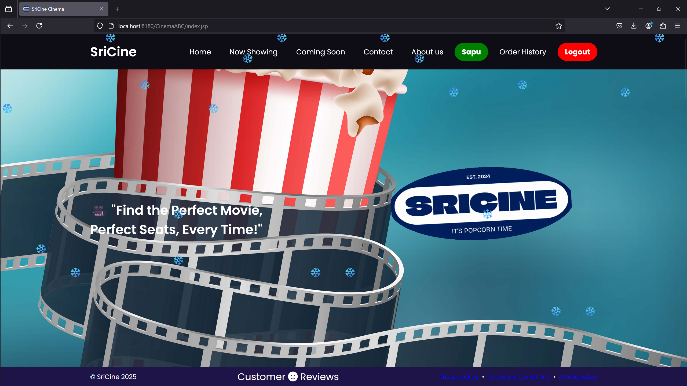
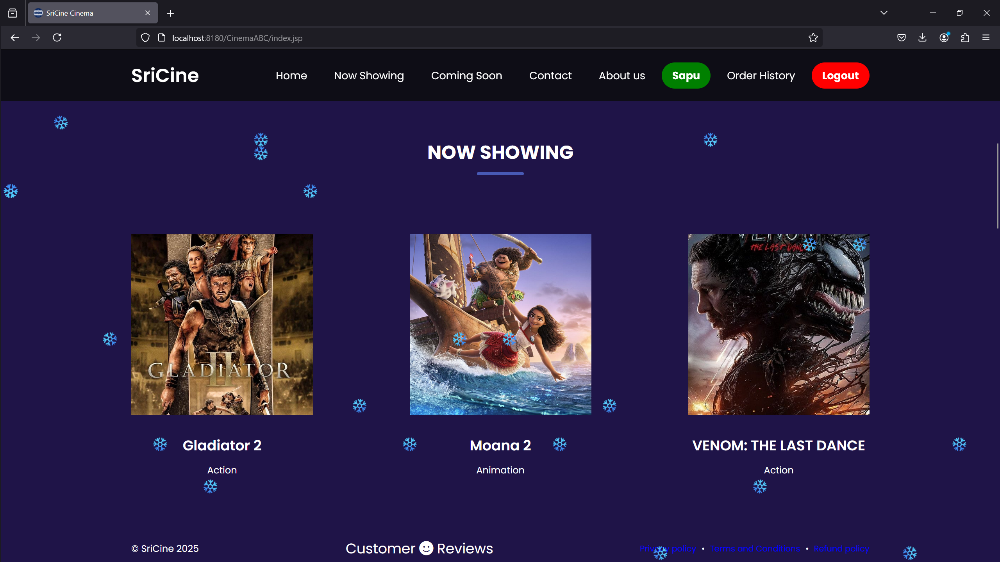
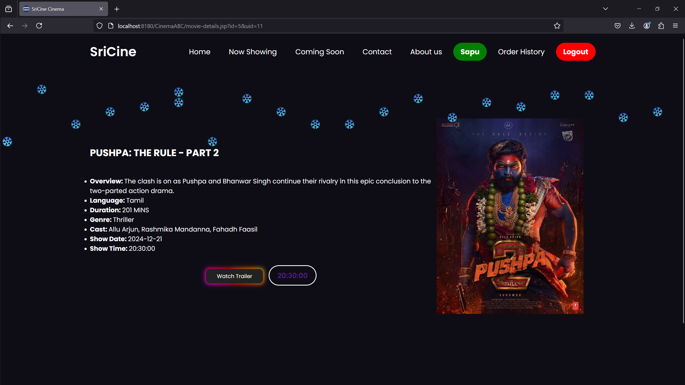
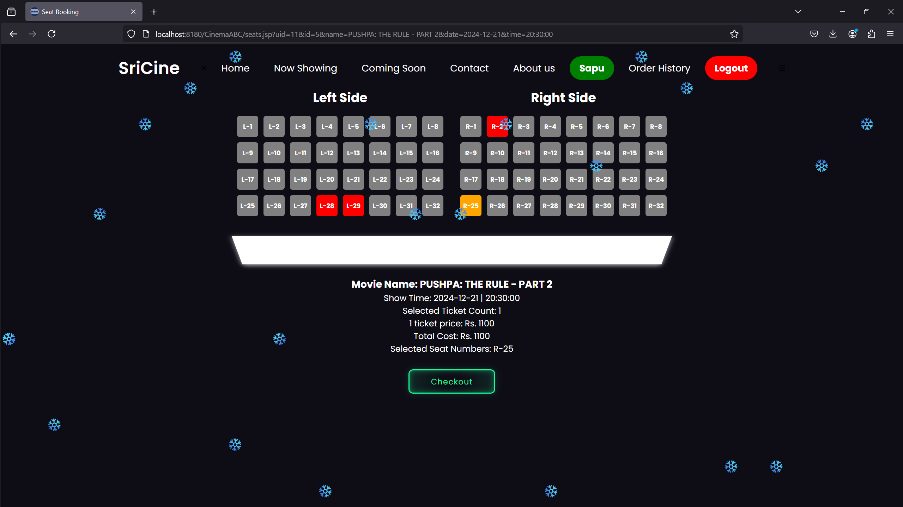
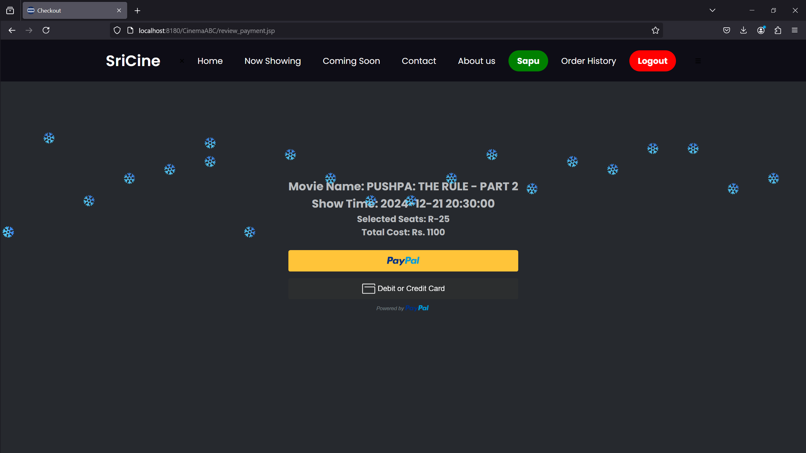
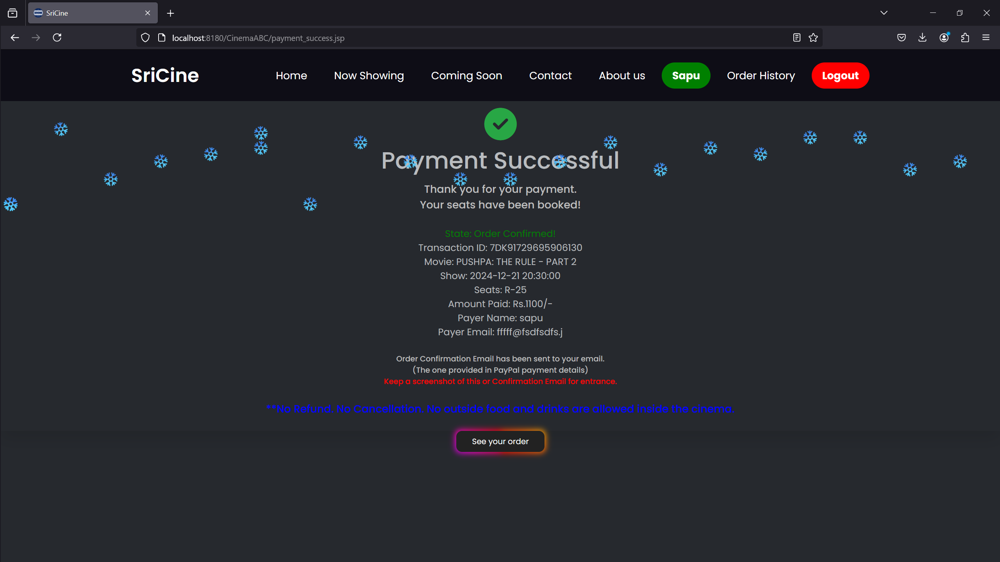
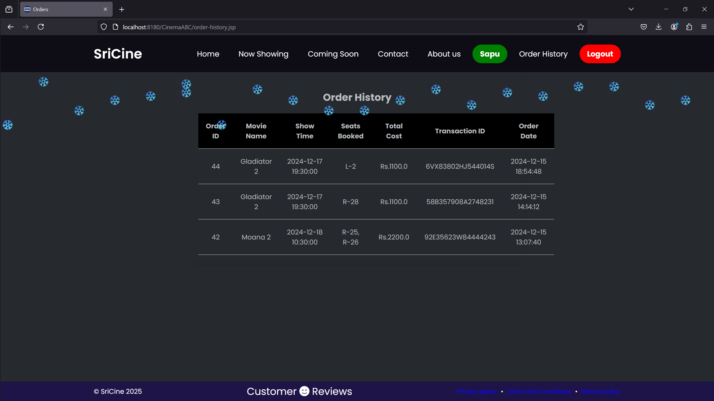

<!DOCTYPE html>
<html lang="en">
<head>
    <meta charset="UTF-8">
    <meta name="viewport" content="width=device-width, initial-scale=1.0">
</head>
<body>
    <header>
        <h1>SriCine Cinema Ticket Booking Project</h1>
        
This is a project for booking online tickets for movies with many features created with Java JSP Servlets and MySQL for the database.

    </header>
    <section>
      
       
      
      
      
      
      
      
    </section>
</body>
</html>
